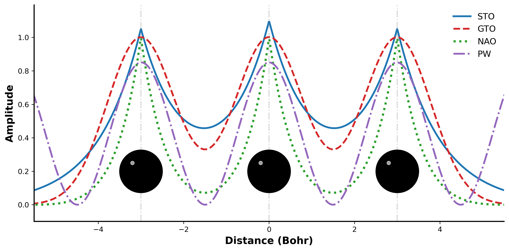

# Basis Set Comparison

Python script that visualizes and compares different atomic orbital basis sets used in quantum chemistry calculations: STO (Slater-Type Orbital), GTO (Gaussian-Type Orbital), NAO (Numerical Atomic Orbital), and PW (Plane Wave).

## Output



## Usage

```bash
python basissetcomparison.py
```

### Requirements

- `numpy`
- `matplotlib`
